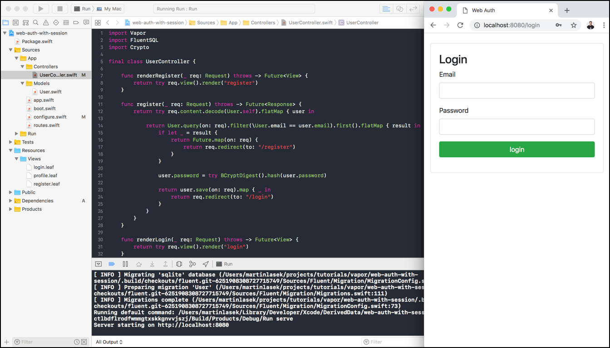

  <h2>Web Auth with Session 👨🏼‍💻 </h2>
  <h3>Tutorial to build this project</h3>
  <h4><a href="https://medium.com/@martinlasek/tutorial-how-to-build-web-auth-with-session-f9f64ba49830">How to build Web Auth with Session</a></h4>
   
  

## Community 🚀
Join the awesome and welcoming Vapor community in <a href="http://vapor.team/"><b>Discord!</b></a>
